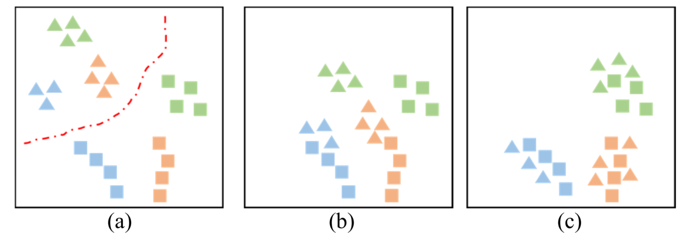

## Abstract
Unsupervised domain adaptive object detection aims to adapt a well-trained detector from its original source domain with rich labeled data to a new target domain with unlabeled data. Recently, mainstream approaches perform this task through adversarial learning, yet still suffer from two limitations. First, they mainly align marginal distribution by unsupervised cross-domain feature matching, and ignore each feature’s categorical and positional information that can be exploited for conditional alignment; Second, they treat all classes as equally important for transferring cross-domain knowledge and ignore that different classes usually have different transferability. In this paper, we propose a joint adaptive detection framework (JADF) to address the above challenges. First, an end-to-end joint adversarial adaptation framework for object detection is proposed, which aligns both marginal and conditional distributions between domains without introducing any extra hyper-parameter. Next, to consider the transferability of each object class, a metric for class-wise transferability assessment is proposed, which is incorporated into the JADF objective for domain adaptation. Further, an extended study from unsupervised domain adaptation (UDA) to unsupervised few-shot domain adaptation (UFDA) is conducted, where only a few unlabeled training images are available in unlabeled target domain. Extensive experiments validate that JADF is effective in both the UDA and UFDA settings, achieving significant performance gains over existing state-of-the-art cross-domain detection methods

## Motivation
Illustration of different domain adaptation methods for a classification task. Different colors denote features from different classes. The square and triangle represent features from the source domain and target domain, respectively. (a) Features from source and target domains are separated by a red dashed line denoting the boundary between the two domains, without domain adaptation. (b) Features from the two domains are marginally adapted, by unsupervised cross-domain feature matching ignoring each feature's categorical attribute. (c) Features from the two domains are jointly adapted by complete adaptation, which considers both marginal adaptation and conditional adaptation that exploits each feature's categorical information.

  

## Framework
The framework of JADF is illustrated as follows.

## Experimental Results
Our experiments are conducted on CityScapses, FoggyCityScapes, PASCAL VOC, Clipart, Watercolor, and Comic. The main experimental results:

## Conclusion
In this paper, we have proposed JADF, a simple and easy-to-utilize, end-to-end adaptive detection framework,towards transferring label-rich knowledge on the source
domain to an unlabeled target domain. JADF considers both marginal and conditional distribution alignment between domains and performs the joint adaptation process through adversarial learning. Besides, since different object classes often have different domain semantic gaps during the conditional adaptation process, we further propose a class-wise
transferability assessment to weaken the cross-domain alignment of hard-to-transfer classes and strengthen the cross-domain matching of easy-to-transfer classes. The
experimental results have demonstrated that JADF significantly exceeds the state-of-the-art cross-domain detection methods in UDA setting and achieves exciting results in the challenging UFDA setting. 

Since the object annotations for the target domain are unavailable, we have to use a well-trained source detector to approximately predict them in the conditional adaptation process. This approximation may result in prediction deviation for the object annotations. Thus, how to provide an unbiased prediction for the target domain needs to be further studied in the future.

[Download paper here](https://arxiv.org/abs/2109.09033)