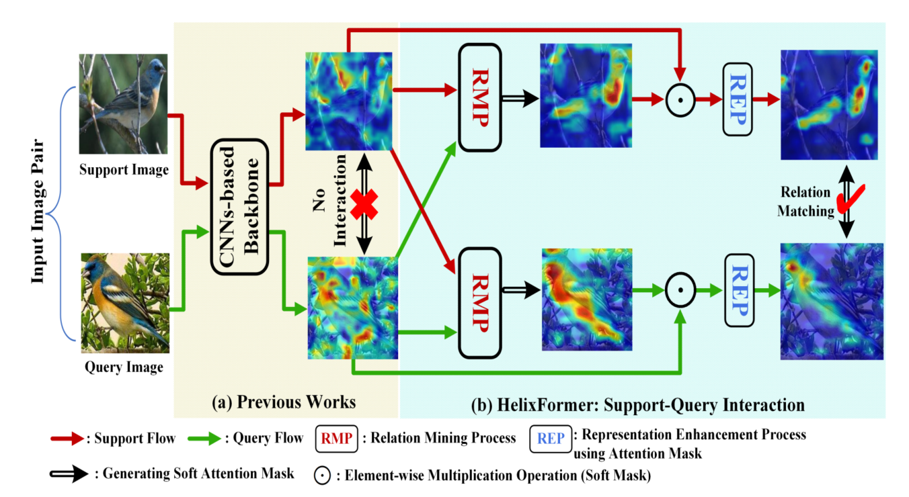
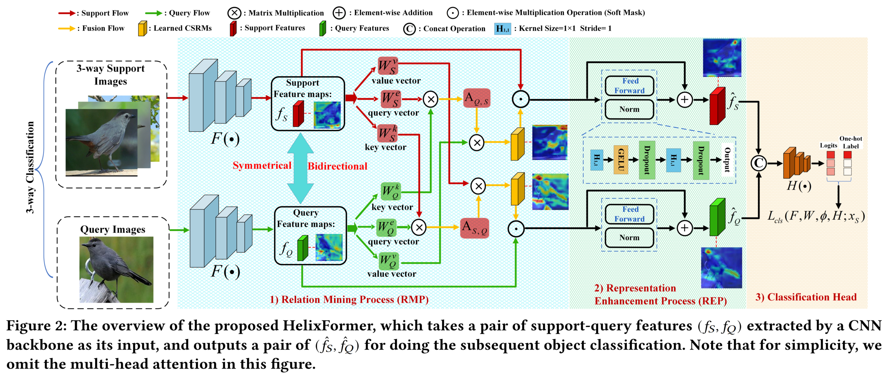
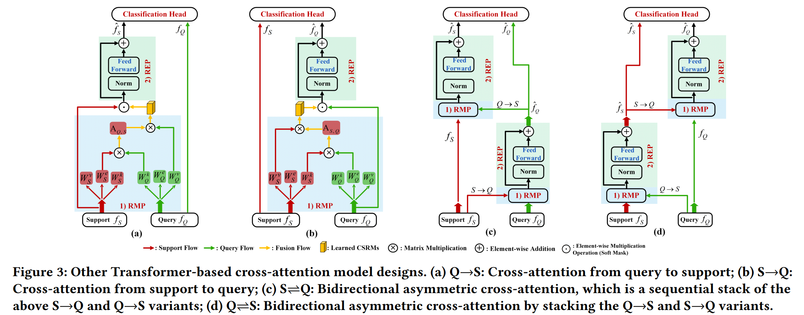
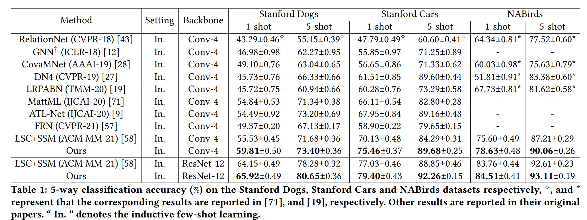
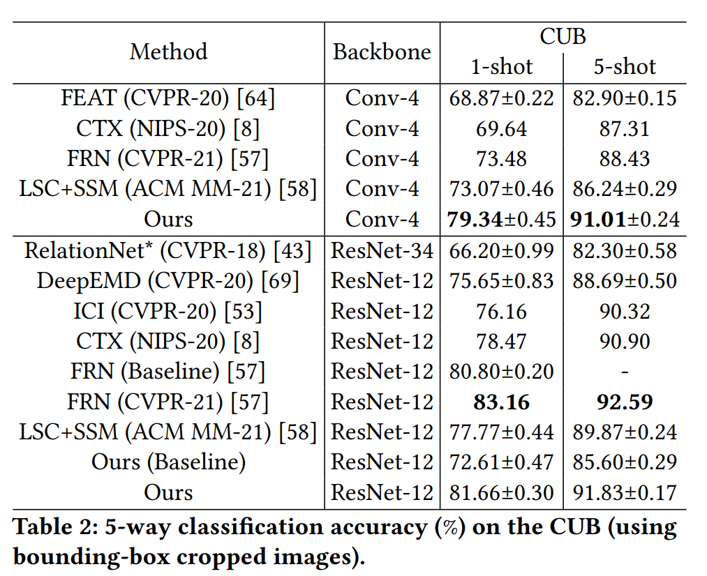
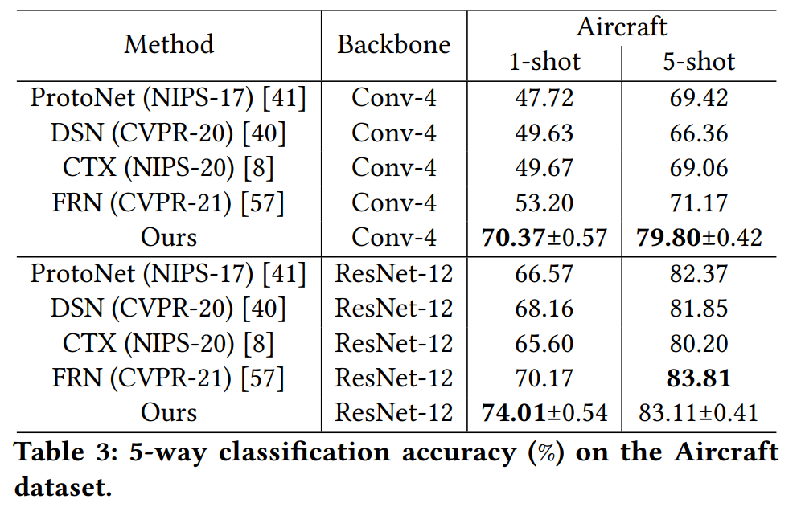

## Abstract
Few-shot fine-grained learning aims to classify a query image into one of a set of support categories with fine-grained differences. Although learning different local differences via Deep Neural Networks has achieved success, how to exploit the query-support cross-image object semantic relations in Transformer-based architecture remains under-explored in the few-shot fine-grained scenario. In this work, we propose a Transformer-based double-helix model, namely HelixFormer, to achieve the cross-image object semantic relation mining in a bidirectional and symmetrical manner. The HelixFormer consists of two steps: 1) Relation Mining Process (RMP) across different branches, and 2) Representation Enhancement Process (REP) within each individual branch. By the designed RMP, each branch can extract fine-grained object-level Cross-image Semantic Relation Maps (CSRMs) using information from the other branch, ensuring better cross-image interaction in semantically related local object regions. Further, with the aid of CSRMs, the developed REP can strengthen the extracted features for those discovered semantically-related local regions in each branch, boosting the model's ability to distinguish subtle feature differences of fine-grained objects. Extensive experiments conducted on five public fine-grained benchmarks demonstrate that HelixFormer can effectively enhance the cross-image object semantic relation matching for recognizing fine-grained objects, achieving much better performance over most state-of-the-art methods under 1-shot and 5-shot scenarios.

## Motivation
(a) Previous fine-grained works attempt to learn discriminative local image parts but have no interaction between support-query images, which may cause relation matching confusion between different fine-grained objects and yield misclassification. (b) In contrast, HelixFormer consisting of RMP and REP modules can mine image pair-level semantically related parts, e.g. birds' wings, and further learn how to distinguish these subtle feature differences to avoid misclassification.

  

## Framework
The framework of HelixFormer is illustrated as follows.

  

Besides, we study other Transformer-based cross-attention model designs, including 4 typical cross-attention structures.

  

## Experimental Results
Our experiments are conducted on Stanford Dogs, Stanford Cars and NABirds. The main experimental results of HelixFormer:

  

  

  

## Conclusion
In this work, to exploit the semantic relations across different fine-grained objects, we proposed a Transformer-based double-helix cross-attention model, namely HelixFormer, which is composed of a Relation Mining Process (RMP) to discover the cross-image object semantic relation and produce patch-level cross-relation maps, and a Representation Enhancement Process (REP) to enhance the identified discriminative local features for final recognition. Experimental results demonstrate that such a bidirectional and symmetrical structure has the merit of ensuring the cross-image object semantic relation consistency, thus further improving the model generalization ability on few-shot fine-grained learning.

[Download paper here](https://arxiv.org/abs/2207.00784)