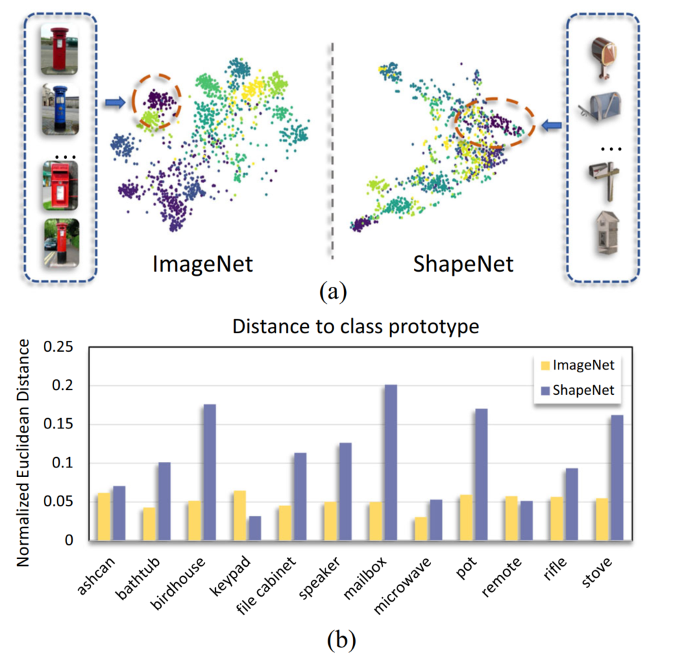
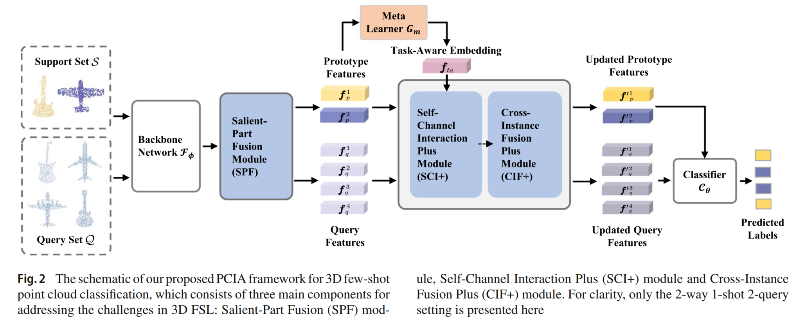
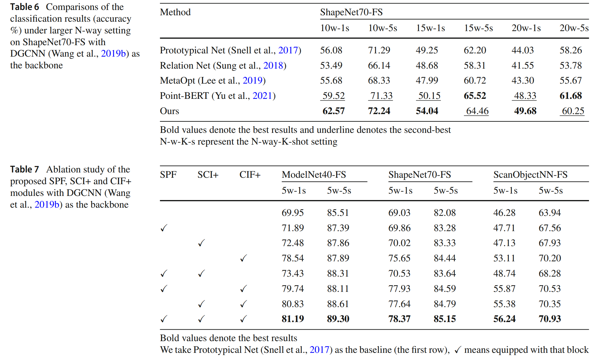

## Abstract
In recent years, research on few-shot learning (FSL) has been fast-growing in the 2D image domain due to the less requirement for labeled training data and greater generalization for novel classes. However, its application in 3D point cloud data is relatively under-explored. Not only need to distinguish unseen classes as in the 2D domain, 3D FSL is more challenging
in terms of irregular structures, subtle inter-class differences, and high intra-class variances when trained on a low number
of data. Moreover, different architectures and learning algorithms make it difficult to study the effectiveness of existing 2D FSL algorithms when migrating to the 3D domain. In this work, for the first time, we perform systematic and extensive
investigations of directly applying recent 2D FSL works to 3D point cloud related backbone networks and thus suggest a strong
learning baseline for few-shot 3D point cloud classification. Furthermore, we propose a new network, Point-cloud Correlation
Interaction (PCIA), with three novel plug-and-play components called Salient-Part Fusion (SPF) module, Self-Channel
Interaction Plus (SCI+) module, and Cross-Instance Fusion Plus (CIF+) module to obtain more representative embeddings
and improve the feature distinction. These modules can be inserted into most FSL algorithms with minor changes and
significantly improve the performance. Experimental results on three benchmark datasets, ModelNet40-FS, ShapeNet70-FS,
and ScanObjectNN-FS, demonstrate that our method achieves state-of-the-art performance for the 3D FSL task.

## Motivation
The challenge of few-shot 3D point cloud classification. a) the T-SNE on ImageNet and ShapeNet using pre-trained 2D image and 3D point cloud features respectively with the “Mailbox” class highlighted. b) the mean normalized Euclidean distance between each example and its class prototype in the visual and point cloud embedding space, respectively. The embedding quality of 2D visual domain is much higher than 3D point cloud domains because image-based pre-trained models, such as ResNet, use deeper networks trained on millions of images, whereas point cloud-based models, such as PointNet, use shallower networks trained on only a few hundred point clouds with subtle inter-class differences and high intra-class variations.

  

## Framework
The baseline network of our method is illustrated as follows.

  

## Experimental Results
Our experiments are conducted on ScanObjectNN, ShapeNet70 and ModelNet40. The main experimental results of HelixFormer:

  

## Conclusion
In this work, we take a closer look at the 3D FSL problem with extensive experiments and analyses, and design a stronger algorithm for the few-shot point cloud classification task. Concretely, we first empirically study the performance of recent 2D FSL algorithms when migrating to the 3D domain
with different kinds of point cloud backbone networks, and thus construct three comprehensive benchmarks and suggest a strong baseline for few-shot 3D point cloud classification. Furthermore, to address the subtle inter-class differences and high intra-class variance issues, we come up with a
new network, Point-cloud Correlation Interaction (PCIA), with three plug-and-play modules, namely the Salient-Part Fusion (SPF) Module , the Self-Channel Interaction Plus (SCI+) Module, and the Cross-Instance Fusion Plus (CIF+) Module. These modules can be easily inserted into different FSL algorithms with significant performance improvement for 3D FSL. We validate the proposed network on three 3D FSL benchmark datasets, including ModelNet40-FS, ShapeNet70-FS and ScanObjectNN-FS, on which our network achieves the state-of-the-art performance.

[Download paper here](https://link.springer.com/article/10.1007/s11263-022-01731-4)