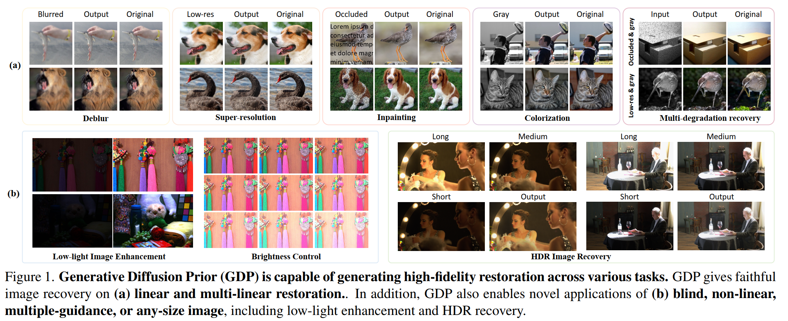
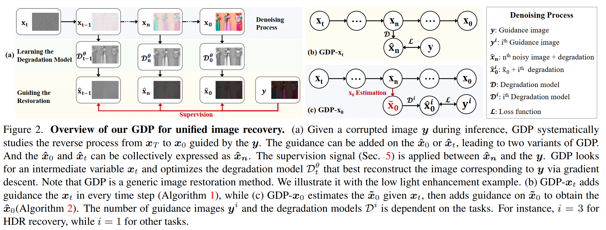
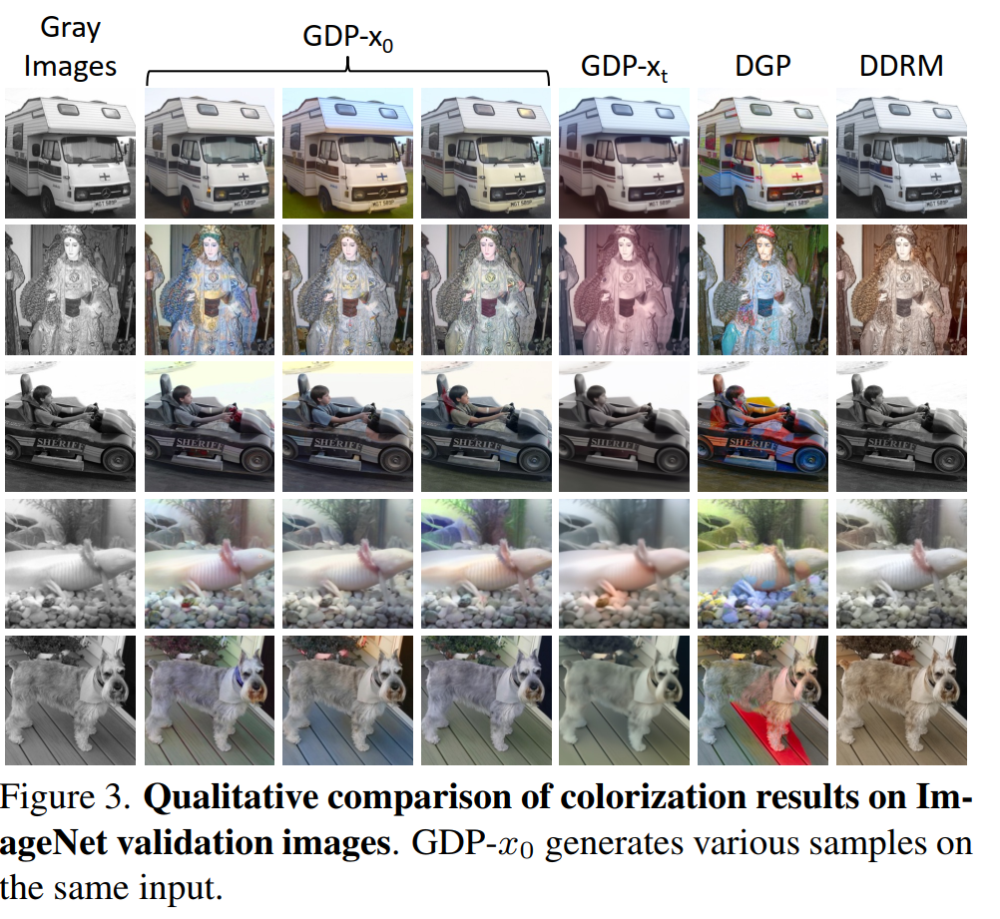
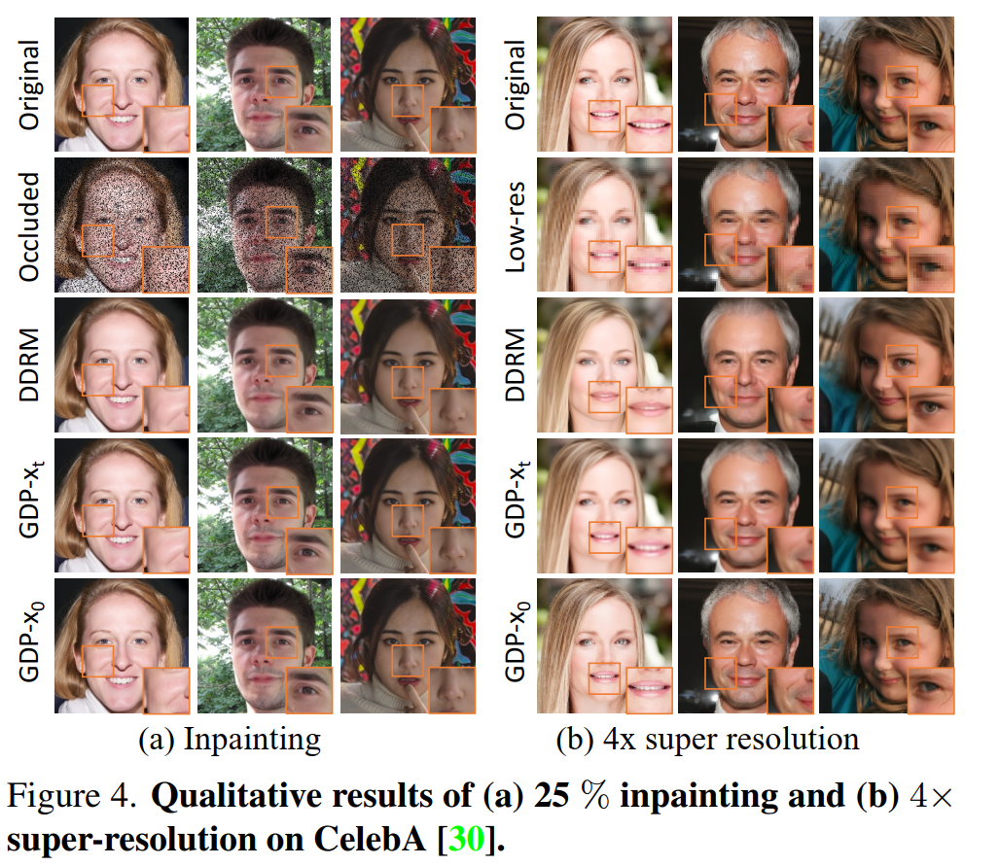
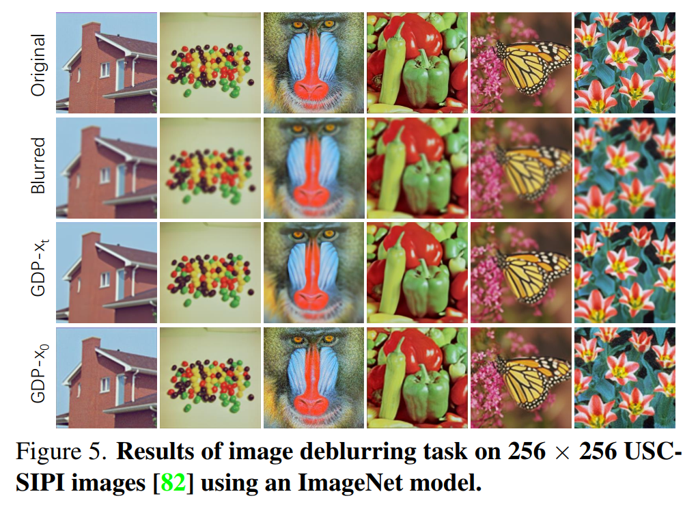
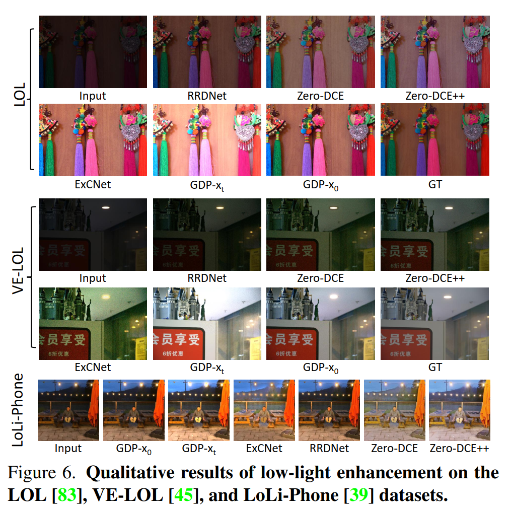
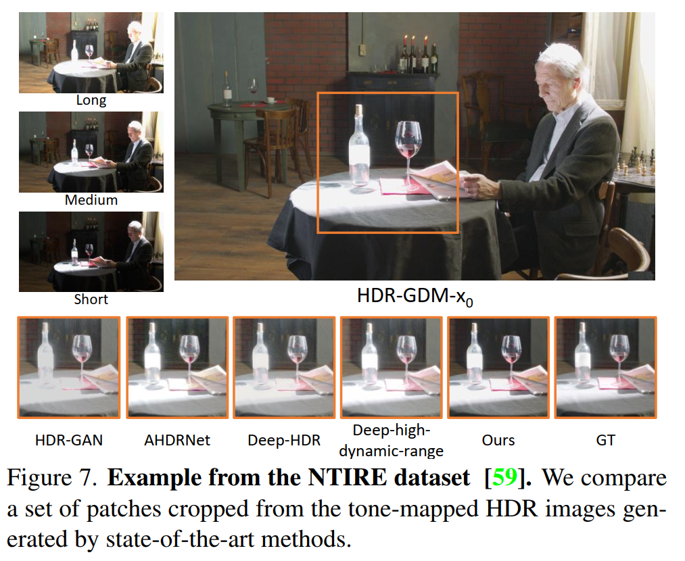

## Abstract
Existing image restoration methods mostly leverage the posterior distribution of natural images. However, they often assume known degradation and also require supervised training, which restricts their adaptation to complex real applications. In this work, we propose the Generative Diffusion Prior (GDP) to effectively model the posterior distributions in an unsupervised sampling manner. GDP utilizes a pre-train denoising diffusion generative model
(DDPM) for solving linear inverse, non-linear, or blind problems. Specifically, GDP systematically explores a protocol of conditional guidance, which is verified more practical than the commonly used guidance way. Furthermore,
GDP is strength at optimizing the parameters of degradation model during the denoising process, achieving blind image restoration. Besides, we devise hierarchical guidance and patch-based methods, enabling the GDP to generate images of arbitrary resolutions. Experimentally, we demonstrate GDP ’s versatility on several image datasets for linear problems, such as super-resolution, deblurring, inpainting, and colorization, as well as non-linear and blind issues, such as low-light enhancement and HDR image recovery. GDP outperforms the current leading unsupervised methods on the diverse benchmarks in reconstruction quality and perceptual quality. Moreover, GDP also generalizes well for natural images or synthesized images with arbitrary sizes from various tasks out of the distribution of the ImageNet training set.

## Motivation
Generative Diffusion Prior (GDP) is capable of generating high-fidelity restoration across various tasks. GDP gives faithful image recovery on (a) linear and multi-linear restoration.. In addition, GDP also enables novel applications of (b) blind, non-linear, multiple-guidance, or any-size image, including low-light enhancement and HDR recovery

  

## Framework
The baseline network of Generative Diffusion Prior (GDP) is illustrated as follows.

  

## Experimental Results
Our experiments are conducted on ImageNet. The main experimental results of Generative Diffusion Prior (GDP):

  

  

  

  

  

## Conclusion
In this paper, we propose the Generative Diffusion Prior for unified image restoration that can be employed to tackle the linear inverse, non-linear and blind problems. Our GDP is able to restore any-size images via hierarchical guidance and patch-based methods. We systematically studied the way of guidance to exploit the strength of the DDPM. The GDP is comprehensively utilized on various tasks such as super-resolution, deblurring, inpainting, colorization, lowlight enhancement, and HDR recovery, demonstrating the capabilities of GDP on unified image restoration.

[Download paper here](https://link.springer.com/article/10.1007/s11263-022-01731-4)