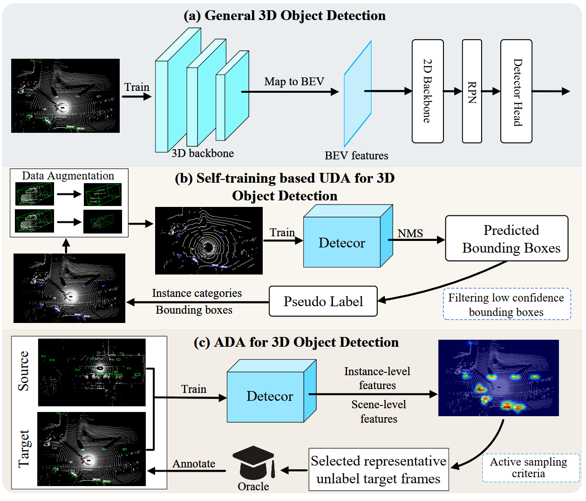
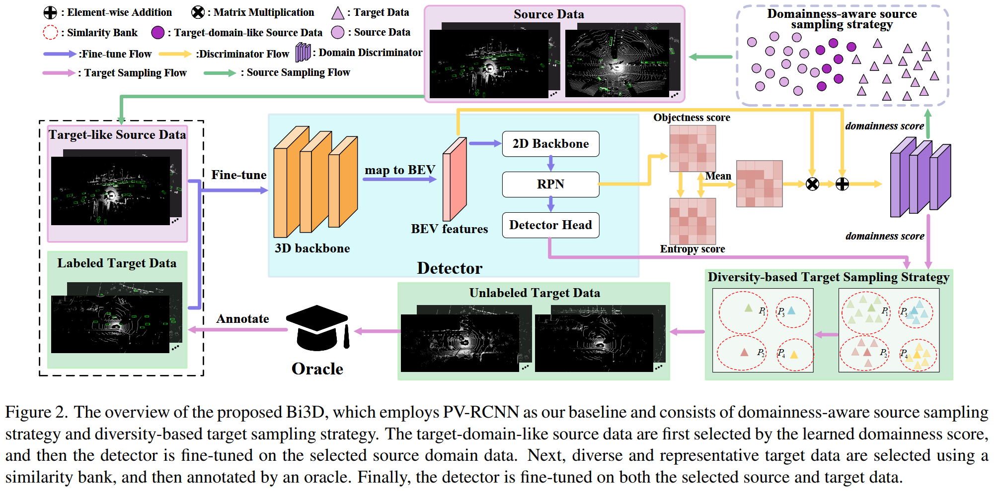
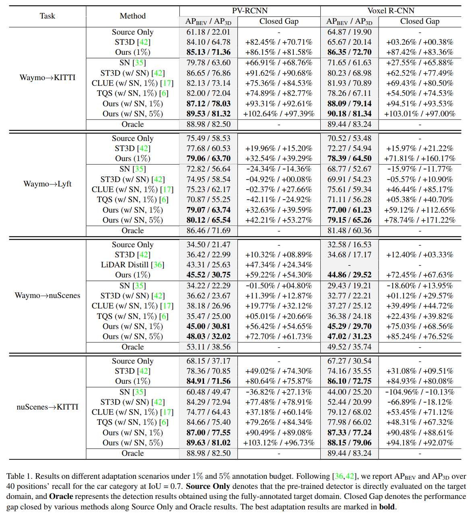
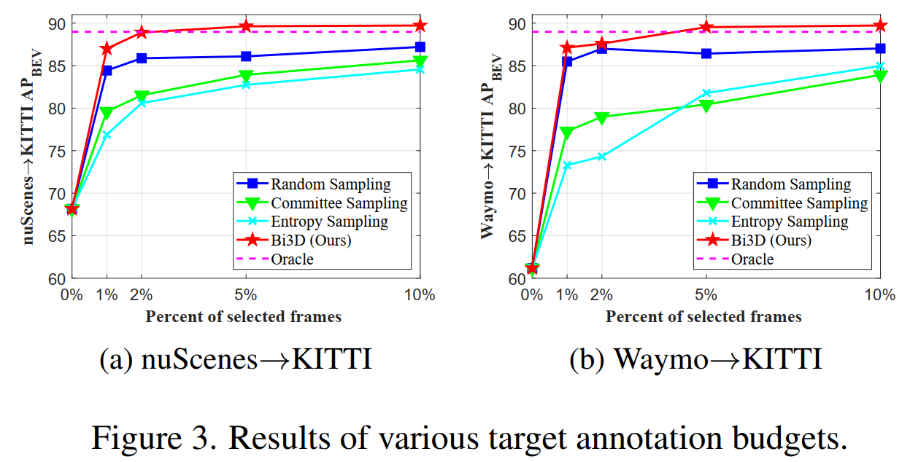
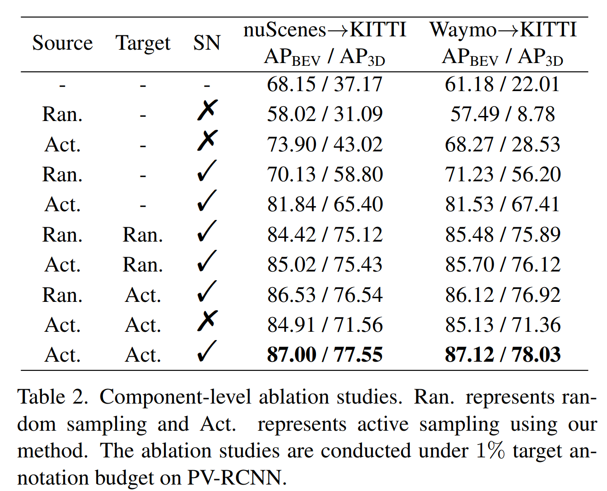

## Abstract
Unsupervised Domain Adaptation (UDA) technique has been explored in 3D cross-domain tasks recently. Though preliminary progress has been made, the performance gap between the UDA-based 3D model and the supervised one trained with fully annotated target domain is still large. This motivates us to consider selecting partial-yetimportant target data and labeling them at a minimum cost, to achieve a good trade-off between high performance and
low annotation cost. To this end, we propose a Bi-domain active learning approach, namely Bi3D, to solve the crossdomain 3D object detection task. The Bi3D first develops a domainness-aware source sampling strategy, which identifies target-domain-like samples from the source domain to avoid the model being interfered by irrelevant source data. Then a diversity-based target sampling strategy is developed, which selects the most informative subset of target domain to improve the model adaptability to the target domain using as little annotation budget as possible. Experiments are conducted on typical cross-domain adaptation scenarios including cross-LiDAR-beam, cross-country, and crosssensor, where Bi3D achieves a promising target-domain detection accuracy (89.63% on KITTI) compared with UDAbased work (84.29%), even surpassing the detector trained on the full set of the labeled target domain (88.98%).

## Motivation
Comparisons among (a) the general 3DOD pipeline, (b) self-training based Unsupervised Domain Adaptation 3DOD pipeline, and (c) Active Domain Adaptation 3DOD pipeline that selects representative target data, and then annotates them by an oracle (human expert) for subsequent model refinement.

  

 

## Framework
The baseline network of Bi3D is illustrated as follows.

  

## Experimental Results
Our experiments are conducted on Waymo, nuScenes, KITTI, and Lyft. The main experimental results of Bi3D:

  

  

  

## Conclusion
In this work, for the first time, we presented a Bi3D framework, which develops a Bi-domain active sampling approach to dynamically select important frames from both source and target domains, achieving domain transfer at a low data cost. Experimentally, Bi3D achieves consistent accuracy gains on many cross-domain settings, e.g., for Waymo-to-KITTI setting, Bi3D re-trained on only 5% target domain data (KITTI) outperforms the corresponding baseline model trained using 100% labeled KITTI data.

[Download paper here](https://link.springer.com/article/10.1007/s11263-022-01731-4)