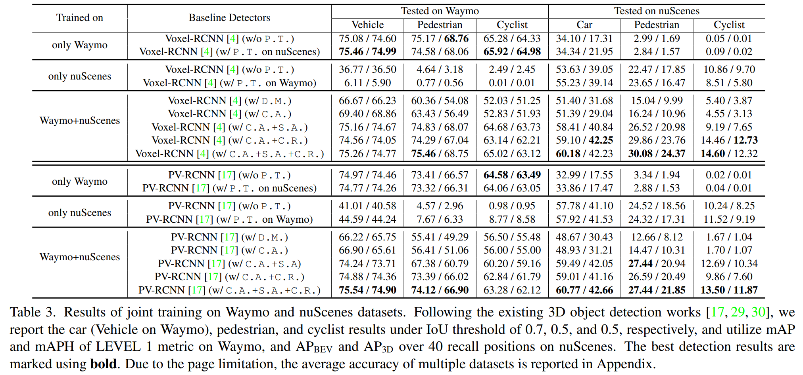

## Abstract
Current 3D object detection models follow a single dataset-specific training and testing paradigm, which often faces a serious detection accuracy drop when they are directly deployed in another dataset. In this paper, we
study the task of training a unified 3D detector from multiple datasets. We observe that this appears to be a challenging task, which is mainly due to that these datasets present substantial data-level differences and taxonomylevel variations caused by different LiDAR types and data acquisition standards. Inspired by such observation, we present a Uni3D which leverages a simple data-level correction operation and a designed semantic-level couplingand-recoupling module to alleviate the unavoidable datalevel and taxonomy-level differences, respectively. Our method is simple and easily combined with many 3D object detection baselines such as PV-RCNN and Voxel-RCNN,
enabling them to effectively learn from multiple off-theshelf 3D datasets to obtain more discriminative and generalizable representations. Experiments are conducted on many dataset consolidation settings including WaymonuScenes, nuScenes-KITTI, Waymo-KITTI, and WaymonuScenes-KITTI consolidations. Their results demonstrate that Uni3D exceeds a series of individual detectors trained
on a single dataset, with a 1.04× parameter increase over a selected baseline detector. We expect this work will inspire the research of 3D generalization since it will push the limits of perceptual performance.

## Motivation
Challenges in training a detector from multiple datasets: 1) Only Waymo and Only nuScenes refer to the baseline detector trained on each individual dataset. 2) Direct Merging represents that we simply merge Waymo and nuScenes and train the detector on the merged dataset. 3) Ours denotes that the baseline detector is trained using the proposed Uni3D on the merged dataset.

  

## Main Challenges of Multi-datset Training
<u>1) Data-level differences:</u> Compared with 2D natural images that are composed of pixels with a consistent value range of [0, 255], 3D point clouds often are collected using different sensor types with different point cloud ranges, which leads to distributional discrepancy among datasets. And the main differences of the three widely-used datasets are shown as follows. Actually, we found that sensor-derived point range difference is a major factor interfering the common feature learning from multiple datasets, which is due to that the receptive field size for the same objects are very different when data with inconsistent point cloud ranges are fed into the 3D detector. As a result, the point-cloud-range alignment is a necessary pre-processing step for achieving multi-dataset 3D object detection.

  

  

  

<u>2) Taxonomy-level differences:</u> Given a fact that different autonomous driving manufacturers employ inconsistent class definitions and annotation granularity. For example, for Waymo, all vehicles driving on the road, including car and truck, are annotated as one unified category, namely, ‘Vehicle’. While for nuScenes, different vehicles are annotated using different taxonomies with different granularity, such as ‘Car’, ‘Truck, and ‘Van’. As a result, the MDF task needs to consider how to train a 3D detector 
under an inconsistent taxonomy label space and effectively reuse domain-agnostic knowledge that can be shared across different datasets.

 

## Framework
The baseline network of Uni3D is illustrated as follows.

  

  

## Experimental Results
Our experiments are conducted on Waymo, nuScenes and KITTI. To investigate the
feasibility of training 3D baseline detectors from multiple public datasets, we conduct experiments by selecting two representative 3D datasets from three widely-used autonomous driving datasets: Waymo, KITTI, and nuScenes. The main experimental results of Uni3D are shown in the following Tables. 

  

  

  

## Conclusion
In this work, for the first time, we study how to train a unified 3D detection model using the off-the-shelf public 3D benchmarks, and present a unified 3D detection framework (Uni3D) consisting of a data-level correction operation and a semantic-level feature coupling-and-recoupling module, which can be easily combined with the existing 3D detectors. We conduct extensive experiments on many public benchmarks, and the results show the effectiveness of Uni3D in obtaining dataset-level generalizable features.

[Download paper here](https://link.springer.com/article/10.1007/s11263-022-01731-4)